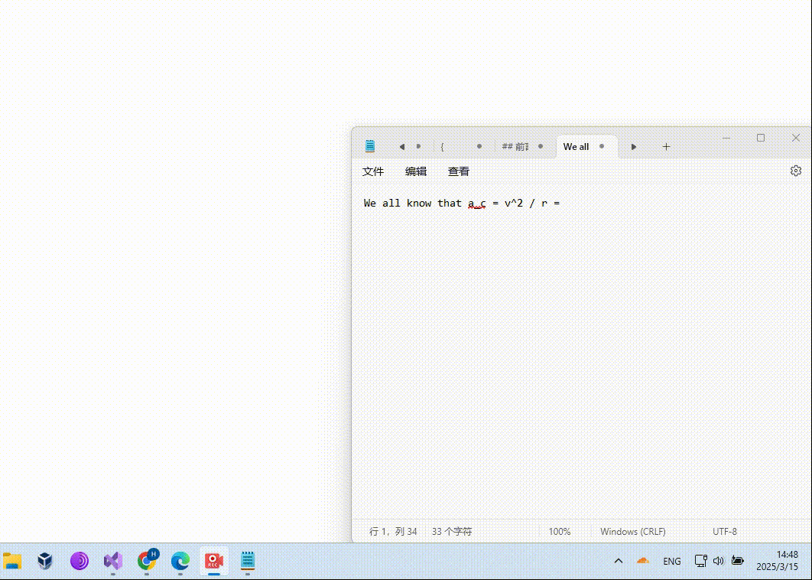

<h1>Symbol Picker</h1>

A simple symbol picker app, similar to the Windows Emoji Picker, that allows you to search for and insert symbols as you type.

<!---->

## Features

* **Searchable symbol picker**: Search in real time with spelling tolerance
* **Insert directly**: Insert symbols to your document directly
* **History memory**: Recent symbol selections are stored for easy access
* **Transparency bar**: New option to customize transparency
* **Customizable**: Settings allow you to customize the application
* **Add your own custom symbols**: You can add your own symbols by editing the `symbols.txt` file with Unicode characters

## Installation

* Download the newest version from [Release](https://github.com/thisismalindu/SymbolPicker/releases)
* Run the installation program
 
OR if there is no installation program (a ZIP)
 
* Put files to `C:\Program Files\SymbolPicker\` (you might need to create the directory manually)

> [!NOTE]  
> You also need .NET Framework to run this app, but it should be pre-installed to your Windows system

<!--
### Launching the App

To launch the app with a keyboard shortcut:

1. Right-click on the **.exe** file and select **Send to > Desktop (Create Shortcut)**.
2. Right-click on the created shortcut and select **Properties**.
3. In the **Shortcut** tab, set your preferred shortcut key.

---
-->

## Project Structure

Here’s a breakdown of the project's folder structure:

<!--I don't think we need to add bin and obj directory, they are managed by visual studio-->
<!--
- **/bin**: Contains the compiled executable files.
- **/obj**: Stores temporary build files generated by Visual Studio.
- **/Properties**: Contains project properties like settings and configurations.
- **Form1.Designer.cs**: The design file for the main form UI.
- **Form1.cs**: The code-behind file for the main form UI.
- **Form1.resx**: The resource file for storing UI components and data.
- **Program.cs**: The entry point for the application.
- **Simulator.cs**: Contains logic for simulating the app’s behavior (if applicable).
- **SymbolPicker.csproj**: The project file containing references and settings for the app.
- **SymbolPicker.csproj.user**: User-specific settings for the project (e.g., IDE preferences).

-->
* **Form1**: The main function window
* **Settings**: The settings window
* **icons8_alpha.ico**: The app's icon.
* **symbols.txt**: A text file where you can add custom symbols (in Unicode).

## Usage

1. Run the application.
2. Use the search bar to find symbols.
3. Click on a symbol to insert to your document.

## Contributing

We welcome contributions! If you'd like to enhance the app or fix issues, feel free to fork the repository and submit a pull request.

## License

This project is open-source under the MIT License. See the [LICENSE](LICENSE) file for more details.

## Acknowledgments

- Inspired by the **Windows Emoji Picker**.
- Thanks to **1234567Yang** for contributing enhancements. See the [pull request here](https://github.com/thisismalindu/SymbolPicker/pull/3).

